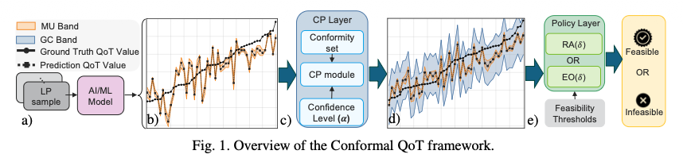

# Policy-Driven Conformal Prediction for Trustworthy QoT Estimation (OFC26)

This branch contains the reference implementation used in the paper:
"Policy-Driven Conformal Prediction for Trustworthy QoT Estimation" (OFC 2026).

It provides a complete, notebook-based pipeline for:
- training QoT regressors on SDM datasets,
- producing conformal prediction bands (global conformal) and model uncertainty (MU) bands,
- evaluating coverage/width, and
- applying policy-driven lightpath feasibility rules for trustworthy QoT decisions
  (risk-averse and efficiency-oriented).



## Paper
- Title: Policy-Driven Conformal Prediction for Trustworthy QoT Estimation
- Conference slot: Monday, March 16, 2026, 17:15-17:30 (Room 403A), session M4A.3
- Schedule: https://www.ofcconference.org/schedule/#/Monday/531347

## Repository Layout
- notebook/cp_qot_sdm.ipynb
  - End-to-end pipeline: data prep, training, conformal bands, and policy evaluation.

- data/sdm/
  - ref paper/datasets_spec.xlsx (dataset specification notes) 
> **Note:**  
> Access to the SDM datasets is restricted. To obtain the datasets used in this pipeline, please contact the corresponding author of the referenced paper.


## Setup
Recommended Python environment:

```bash
python3 -m venv .venv
source .venv/bin/activate
pip install -r requirements.txt
```

## Reproduce the Results
1. Launch Jupyter:

```bash
jupyter lab
```

2. Open and run the notebook:

```text
notebook/cp_qot_sdm.ipynb
```

The notebook is organized into sections:
- data loading and preprocessing
- group selection and train/cal/test splits
- target-domain, transfer-learning, and zero-shot regimes
- conformal band construction (global conformal and model uncertainty)
- coverage and width analysis
- policy-driven classification and metrics

## Outputs
All evaluation artifacts are written under `results_evaluations/`, including
classification summaries and test data used for policy comparisons.

## Policy-Driven Classification
The notebook applies policy-driven decisions on conformal bands using the same
terminology as the paper:
- Risk-averse
- Efficiency-oriented

## Notes
- The datasets are expected in `data/sdm/` as provided in this repository.
- The notebook assumes the SDM datasets and the folder layout above.

## Citation
If you use this code, please cite the OFC 2026 paper:

```bibtex
@inproceedings{Rezaei2026PolicyDriven,
  author    = {Kiarash Rezaei and Omran Ayoub and Paolo Monti and Carlos Natalino},
  title     = {Policy-Driven Conformal Prediction for Trustworthy QoT Estimation},
  booktitle = {Optical Fiber Communication Conference (OFC)},
  year      = {2026},
  note      = {Session M4A.3, March 16, 2026},
}
```
